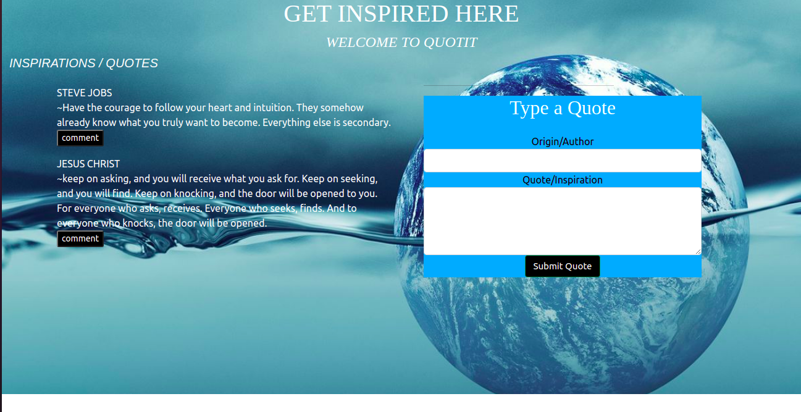
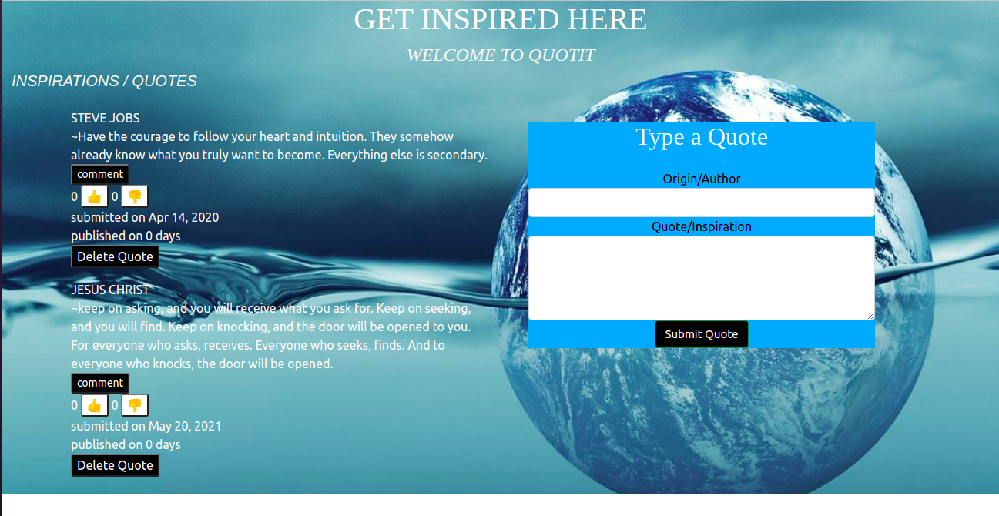

# Quotit

#### AUTHOR **{Maxwell Munene}**

This is a simple application where users can create quotes and have those quotes voted on whether they are Inspirational or Terrible.As a user you will be able to input a quote and will also be able to upvote or to downvote it. This project was generated with Angular CLI.

 (LANDING PAGE)
 (QUOTE SECTIONS)

## Project Objectives
* Project should be created using the Angular CLI.
* Project should contain a custom model class for the quote
* Project should have a custom directive to highlight the quote * that has the highest upvotes.
* Project should contain a form component that has input sections for the quote, the author, and the person who submitted the quote.
* Each quote must begin with an initial upvote and downvote value of 0
* Project should have a component to display the quote and a component to display quote details. For example, the quote details could have the author of the quote and the votes it has.
*Project should contain a custom pipe that shows how much time has passed since the quote was created. 

## Setup/Installation Requirements
* Nothing that needs to be installed prior tracking your quotes.
* To rebuild this app run **git clone https://github.com/tailorv/quot-it.git**  on your command line.

## BDD
 | Input                | Output
 | :-------------:      | :-------------:
 |  Quote/Inspiration               | Text displayed
 |  Author/Origin              | Text displayed
 |  Delete                | Action 
 |  Upvote              | Number displayed > 0
 |  Downvote            | Number displayed > 0

## Technologies Used
 * ANGULAR
 * HTML
 * CSS
 * BOOTSTRAP

## Support and contact details
{ email maxwell.munene@student.moringaschool.com}
### License
{MIT License

Copyright (c) 2021

Permission is hereby granted, free of charge, to any person obtaining a copy
of this software and associated documentation files (the "Software"), to deal
in the Software without restriction, including without limitation the rights
to use, copy, modify, merge, publish, distribute, sublicense, and/or sell
copies of the Software, and to permit persons to whom the Software is
furnished to do so, subject to the following conditions:

The above copyright notice and this permission notice shall be included in all
copies or substantial portions of the Software.

THE SOFTWARE IS PROVIDED "AS IS", WITHOUT WARRANTY OF ANY KIND, EXPRESS OR
IMPLIED, INCLUDING BUT NOT LIMITED TO THE WARRANTIES OF MERCHANTABILITY,
FITNESS FOR A PARTICULAR PURPOSE AND NONINFRINGEMENT. IN NO EVENT SHALL THE
AUTHORS OR COPYRIGHT HOLDERS BE LIABLE FOR ANY CLAIM, DAMAGES OR OTHER
LIABILITY, WHETHER IN AN ACTION OF CONTRACT, TORT OR OTHERWISE, ARISING FROM,
OUT OF OR IN CONNECTION WITH THE SOFTWARE OR THE USE OR OTHER DEALINGS IN THE
SOFTWARE.
}
Copyright (c) {2021} **{Maxwell Munene}**

## Further help
To get more help on the Angular CLI use `ng help` or go check out the [Angular CLI Overview and Command Reference](https://angular.io/cli) page.